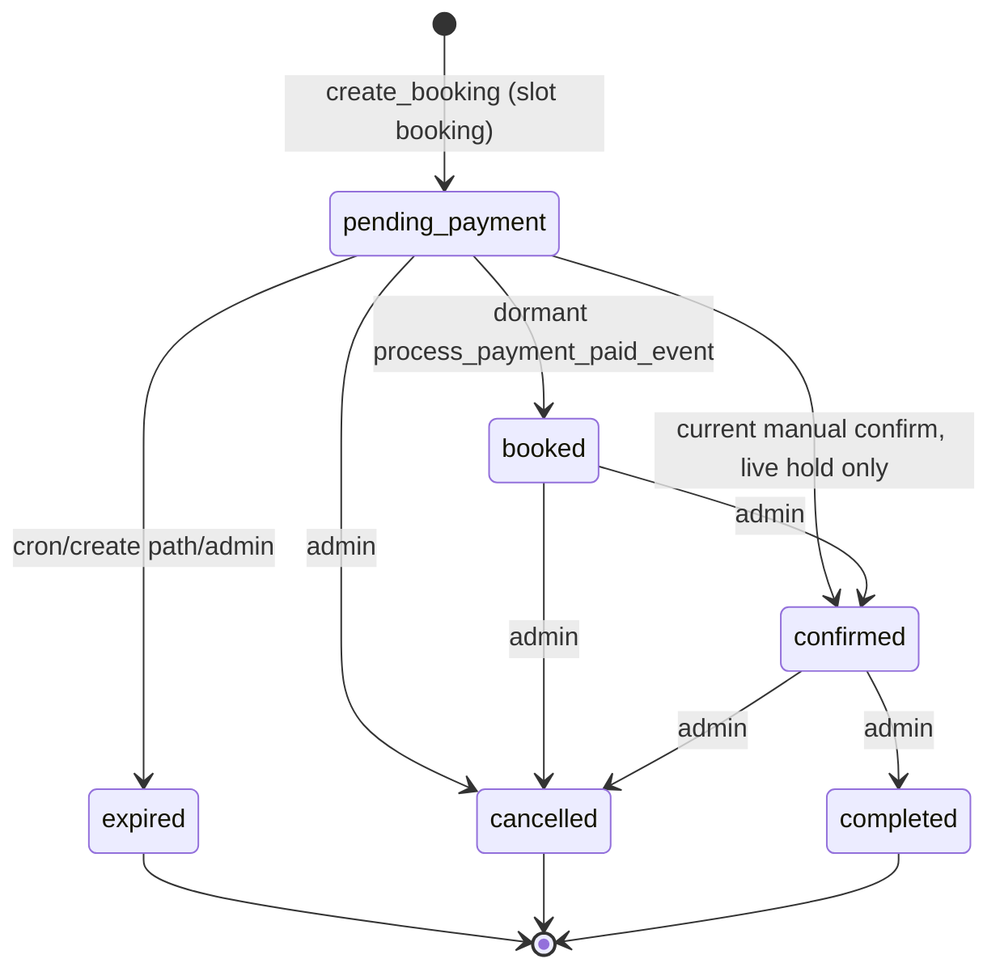

# Mohjaew Phase 1–2 implementation contract

Date: 2026-07-13  
Review basis: repository at `7d9cb19` on `feature/booking-success-live-status`  
Scope: architecture and implementation contract only; no runtime code, migration, environment, deployment, or production data change was performed.

## Executive decision

`NOT_READY_FOR_PHASE_1_IMPLEMENTATION`

Implementation must not begin until the blockers in “Final decision” are closed. The repository contains useful foundations, but the deployed schema cannot be reconstructed reliably from the repository, the dormant paid-event path does not meet the required atomicity invariant, and the receiver/payment-window contract required for automatic acceptance is not yet fixed.

## A. Current-state map

### Repository and package state

- Current branch: `feature/booking-success-live-status`, tracking its origin.
- Worktree was already dirty: modified `.gitignore`; untracked `.vscode/`, `file.md`, and `task3-final-review.diff`. This review did not alter those files.
- Declared core versions: Next `^15.1.6`, React `^19.0.0`, TypeScript `^5.7.0`, Supabase JS `^2.45.4`.
- Locally resolved versions: Next `15.5.19`, React/React DOM `19.2.7`, TypeScript `5.9.3`, Supabase JS `2.108.2`, Supabase SSR `0.5.2`.
- `npm test` and `npm run typecheck` pass. The tests are primarily pure-function and source/regular-expression checks; they do not execute the PostgreSQL migrations against a real database and do not prove transaction/concurrency behavior.

### Migration order and deployment ambiguity

Repository order is:

1. `0001_init.sql` — legacy LINE sessions/bookings/images/webhook events; private `booking-faces` bucket.
2. `0002_booking_slots.sql` — slots, holds, rate limits, booking creation and transitions.
3. `0003_face_upload.sql` — upload intents and atomic claim; header says it was not applied to any environment.
4. `0004_face_upload_cleanup_lease.sql` — leased cleanup.
5. `0005_payment_foundation.sql` — payment orders/events/outbox and dormant payment RPCs; header says not to apply to production before a provider exists.
6. `0006_read_only_get_open_slots.sql` — proposed read-only availability change.
7. `0007_team_notification_outbox.sql` — proposed leased team-delivery worker support; README says it is already applied in production.
8. `0008_reject_expired_hold_confirmation.sql` — proposed hard rejection of late manual confirmation.

There is no Supabase CLI project metadata or checked-in authoritative migration ledger. README setup lists only `0001` and `0002`, while application code depends on later schema. Therefore repository comments conflict and the actual staging/production schema version is unknown.

### Relevant files

| Concern | Current files |
| --- | --- |
| Public booking | `src/app/booking/BookingForm.tsx`, `src/app/api/bookings/route.ts`, `src/lib/booking-core.ts`, `src/lib/slots.ts` |
| Success/payment instructions | `src/app/booking/success/*`, `src/lib/env.ts`, `public/payment-qr.png` |
| Dormant payment page/core | `src/app/pay/[token]/page.tsx`, `src/lib/payments/{types,provider,payment-orders,payment-transitions}.ts` |
| Manual confirmation | `src/app/admin/actions.ts`, `src/app/admin/_components/ConfirmPaymentButton.tsx`, `src/app/admin/bookings/[id]/page.tsx` |
| Hold expiry | `src/app/api/cron/expire-bookings/route.ts`, `.github/workflows/expire-bookings.yml` |
| Team notification | `src/lib/notifications/delivery-worker.ts`, `src/app/api/cron/deliver-notifications/route.ts`, `.github/workflows/deliver-notifications.yml` |
| LINE | `src/lib/line.ts`, `src/app/api/line/webhook/route.ts` |
| Upload pattern | `src/app/api/bookings/face-upload/route.ts`, migrations `0001`, `0003`, `0004` |
| Auth/RLS boundary | `src/lib/auth.ts`, `src/middleware.ts`, `src/lib/supabase/*`, all migrations |
| Environment contract | `.env.example`, `src/lib/env.ts` |

### Relevant database objects

- `booking_sessions`: legacy conversational LINE state; one active session per LINE user.
- `bookings`: central booking record. Slot bookings may have `pending_payment`, `booked`, `confirmed`, `cancelled`, `expired`, or `completed`; legacy values `pending` and `contacted` remain.
- `booking_slots`: date/time/capacity/open state.
- `booking_images`: private face-image path linkage.
- `booking_face_uploads`: opaque upload intent, lifecycle, cleanup lease, and HMACed IP.
- `api_rate_limits`: cross-instance request counters.
- `line_webhook_events`: legacy webhook idempotency inbox; current webhook no longer inserts.
- `payment_orders`: provider-neutral amount in satang, public `checkout_token`, expiry, and payment status. No production route currently creates an order.
- `payment_webhook_events`: provider event inbox. It is webhook-oriented and does not model uploaded-slip attempts cleanly.
- `notification_deliveries`: durable outbox; the active worker claims only team `payment_received` rows.
- Missing: immutable booking/payment audit table, verified transaction identity table, slip attempt table, private slip bucket, and LINE identity-link evidence.

### Relevant RPCs

- `record_rate_hit`: DB-backed cross-instance abuse counter.
- `create_booking`: slot row lock, validation, capacity, duplicate phone/slot guard, booking idempotency, optional face-upload claim.
- `transition_slot_booking`: booking/slot locking and the admin state machine. Migration `0008` rejects confirmation after the hold deadline.
- `expire_pending_bookings`: expires stale `pending_payment` rows.
- `get_open_slots`: capacity calculation; `0006` removes a write from this read path.
- `create_payment_order`: locks booking, requires a live hold, stores the caller-supplied server amount, and is idempotent.
- `process_payment_paid_event`: dormant paid-event handler. It validates only amount and certain booking statuses; it does not validate receiver, accepted transfer window, or global transaction reference.
- `expire_due_payment_orders`: expires orders and still-pending bookings, but the current cron route does not call it.
- `claim_team_notification_deliveries` / `complete_notification_delivery`: leased team-only outbox processing with retry/dead outcomes.
- Face-upload cleanup claim/completion RPCs use row locks, leases, and fencing tokens.

### Current state transitions



Legacy non-slot bookings separately allow `pending/contacted/confirmed/cancelled` through direct table updates after server-side admin checks.

The business requirement says successful automatic verification must produce the same trusted state as current manual confirmation: `confirmed`. That conflicts with `0005`, which produces `booked` and awaits another admin action.

### Current manual payment confirmation

`confirmPayment` requires an authenticated allowlisted admin, loads the booking, requires a slot booking in `pending_payment` with a live hold, then calls `transition_slot_booking(..., 'confirmed')`. The client cannot choose the target status. Migration `0008` repeats the live-hold check under row lock with the database clock.

The UI confirmation text hardcodes `999 THB`. The success page reads `BOOKING_PAYMENT_AMOUNT_THB`. Neither is payment truth. The `/pay/[token]` page correctly renders `payment_orders.amount_satang`, but no live path creates that order.

### Hold expiration

- Default hold is 30 minutes, configurable and clamped to 5–120 minutes.
- Availability ignores lapsed holds immediately via `hold_expires_at > now()`.
- New booking creation expires lapsed holds for the selected slot while holding its row lock.
- A bearer-authenticated GitHub Actions job calls `/api/cron/expire-bookings` every five minutes.
- That route calls `expire_pending_bookings` and face cleanup, not `expire_due_payment_orders`; active payment orders can remain `created/pending` after their booking expires.
- Migration `0008` is the required DB-clock backstop against confirming during the cron lag, but its applied status is unknown.

### Notification behavior

- Booking creation still sends a direct, non-durable team LINE notification. Its failure never rolls back booking creation.
- Paid-event processing inserts customer `payment_confirmed` and team `payment_received` outbox rows with unique idempotency keys.
- The current worker only sends team `payment_received`. It uses leased claims, fencing, exponential backoff, jitter, and a kill switch.
- The worker sends internal booking/payment UUIDs in the team message; this is operationally useful but should be replaced with an admin URL/reference where possible.
- LINE push currently lacks `X-Line-Retry-Key`. A timeout after LINE accepts a message can therefore cause a duplicate on retry. LINE explicitly recommends a stable retry key for push retries ([official guidance](https://developers.line.biz/en/docs/messaging-api/retrying-api-request/)).

### Storage/upload pattern

- `booking-faces` is private and accessed only with the service role or signed URLs.
- Face upload uses opaque tokens and server-generated paths, 5 MB cap, MIME allowlist, idempotency, HMACed IP rate limiting, and leased orphan cleanup.
- It trusts browser MIME and extension-derived output, and does not inspect magic bytes or decoded dimensions. It is therefore a pattern for lifecycle and privacy, not a sufficient validator for bank slips.
- EasySlip v2 currently documents a 4 MB image maximum; it accepts JPEG, PNG, GIF, and WebP. Mohjaew should deliberately narrow this to JPEG/PNG/WebP and cap at 4 MB ([EasySlip v2 documentation](https://document.easyslip.com/en/v2/verify/bank/)).

### RLS and access controls

- All application tables have RLS enabled. No anon/authenticated data policies are defined; later migrations also revoke table privileges.
- Core RPC execution is revoked from public/anon/authenticated and granted to service role.
- Team worker RPCs are `SECURITY DEFINER`, pin `search_path`, schema-qualify objects, and remain service-role-only.
- Admin access uses Supabase auth plus `ADMIN_EMAILS`; service-role data access is server-only.
- Cron endpoints fail closed if `CRON_SECRET` is missing and require an exact bearer token.

### Current environment contract

Present contract: app/Supabase URL and keys, LINE Messaging API secrets/group, admin allowlist, HMAC rate-limit secret, hold duration, cron secret, outbox kill switch, static payment amount/bank/account/QR, and LINE OA URL.

Missing Phase 1 contract: EasySlip base URL/API key/timeout, active adapter, receiving-account matcher/fingerprint, slip bucket, upload limits, accepted payment-window policy, retention periods, and Phase 1 kill switch.

Missing Phase 2 contract: LIFF ID, LINE Login channel ID, token-verification settings, identity-ticket signing key, and customer-delivery kill switch.

### Existing controls worth preserving

- Server/service-role boundary and deny-by-default RLS.
- DB row locks for slot capacity and status transitions.
- Booking/order idempotency keys.
- HMACed-IP, DB-backed rate limiting.
- Private storage, opaque upload handles, signed access.
- Cron authentication, outbox kill switches, leases, fencing, and bounded retries.
- No provider secrets in browser code; no raw LINE response bodies or tokens in logs.

### Existing gaps

1. No authoritative applied-migration state.
2. No live payment-order creation path; current success page uses static payment configuration and booking UUID as its public token.
3. Current provider interface is checkout/webhook-oriented, not uploaded-slip verification-oriented.
4. Paid-event RPC lacks receiver, timestamp, and transaction replay validation.
5. Paid-event RPC can mark an order paid, update zero booking rows, still mark the event processed, and enqueue success notifications.
6. No global unique `(provider, transaction_reference)` payment identity.
7. Raw `provider_payload` columns encourage unnecessary retention.
8. No audit event written atomically with confirmation.
9. Payment-order expiry is disconnected from the active expiry job.
10. No private slip lifecycle or strict file validation.
11. No Phase 2 trusted LINE identity link or customer worker.
12. Existing LINE retries are at-least-once and may duplicate after an ambiguous timeout.

## B. Proposed Phase 1 architecture

### Mandatory business invariant

For Phase 1, a valid slip must atomically transition a live `pending_payment` slot booking to `confirmed`, exactly matching current manual confirmation. Do not use `booked` for this path. Preserve `booked` only for existing data compatibility until a later, separately approved cleanup.

### Request flow

1. Public booking submission remains server-routed and idempotent.
2. The server creates or idempotently returns a payment order for the booking. The browser never sends an amount. The order stores `99900` satang (or the approved server-side price) as immutable payment truth.
3. Return only `checkout_token`, display reference, slot summary, order amount, expiry, and server-generated PromptPay QR derived from the order. Do not return booking/order UUIDs.
4. `/pay/[checkout_token]` loads the order and booking server-side. The token is never interpreted as a booking ID.
5. `POST /api/payments/[token]/slip` accepts one multipart file and no amount, booking ID, receiver, timestamp, transaction reference, or verification flag.
6. Before reading the full body: apply request/content-length limit and rate limits keyed by HMAC(IP), checkout-token hash, and a global/provider circuit budget. Idempotent successful rechecks do not consume provider quota.
7. Load the order and booking by checkout token. Fail closed unless order is active and booking is potentially eligible. Use generic client errors; log only fixed codes and non-secret correlation IDs.
8. Validate extension, declared MIME, magic bytes, decoded format, maximum 4 MB, maximum 8,000×8,000, and maximum 20 megapixels. Reject animation/multiple frames and malformed decode. Re-encode is optional but provider input must be the validated buffer.
9. Store the validated original in private `payment-slips` under a random server path; never return the path. If provider processing cannot start, record a retryable attempt and retain according to policy.
10. Call the selected `SlipVerificationProvider` with a 10-second timeout, one attempt per request, and `checkDuplicate`/account/amount matching where supported. Never retry the external call blindly in the same request after an ambiguous timeout.
11. Parse the provider response strictly into a normalized result. A missing/invalid critical field is `malformed_response`, never success.
12. Pass only normalized evidence to a new atomic RPC. The RPC locks order, booking, slot, and transaction identity, then returns a stable outcome.
13. On success, the client polls existing non-PII status and sees `confirmed`. Team notification is delivered from the existing outbox; no direct success notification is sent in the HTTP transaction.

### Provider adapter contract

```ts
type SlipVerificationRequest = {
  image: Buffer;
  mediaType: "image/jpeg" | "image/png" | "image/webp";
  expectedAmountSatang: number;
  receiverProfile: string; // server-only configured profile key
  correlationId: string;   // non-PII
};

type NormalizedSlipResult =
  | {
      kind: "verified";
      provider: string;
      transactionReference: string;
      transferredAt: string; // ISO-8601 with explicit offset
      amountSatang: number;
      currency: "THB";
      receiverProfile: string;
      receiverMatched: true;
      providerDuplicateHint: boolean | null;
      evidenceHash: string; // hash of canonical normalized evidence
    }
  | {
      kind: "rejected";
      provider: string;
      code: "not_a_slip" | "not_genuine" | "unsupported_bank" | "unreadable";
    }
  | {
      kind: "indeterminate";
      provider: string;
      code:
        | "timeout"
        | "rate_limited"
        | "quota_exhausted"
        | "provider_unavailable"
        | "malformed_response"
        | "timestamp_ambiguous";
      retryable: boolean;
    };

interface SlipVerificationProvider {
  readonly name: string;
  verify(request: SlipVerificationRequest): Promise<NormalizedSlipResult>;
}
```

EasySlip-specific HTTP paths, field names, response codes, credentials, matching flags, and redaction remain solely in `src/lib/payments/providers/easyslip.ts`. EasySlip v2 uses bearer authentication and supports receiver/amount matching, but Mohjaew still performs its own comparisons against the order and receiver profile ([official v2 overview](https://document.easyslip.com/en/v2/)).

### Database changes

Use a new migration only after the applied-schema blocker is resolved. Provisional next filename is `0009_phase1_slip_verification.sql`; renumber if the authoritative ledger shows otherwise.

- Extend `payment_orders` only as needed with `receiver_profile`, `verification_method`, and a constraint preventing amount/currency mutation after creation. Stop writing raw `provider_payload` and `failure_message`; leave existing columns for compatibility.
- Add `payment_receiving_accounts` (service-role-only): stable profile key, provider, canonical account matcher/fingerprint, active dates. Exact representation must be proven from an EasySlip sandbox response before migration is finalized.
- Add `payment_slip_attempts`: order ID, random storage path, SHA-256, safe media metadata, outcome code, transaction reference when available, amount/timestamp/receiver profile, provider, timestamps, review status. No sender name and no raw provider response.
- Add `payment_transactions`: provider, normalized transaction reference, payment order, amount/timestamp/evidence hash, accepted timestamp. Unique constraint on `(provider, transaction_reference)` is the replay backstop.
- Add `booking_events`: immutable booking/payment audit events with actor type, event code, related order/attempt, and minimal metadata.
- Create private `payment-slips` bucket. No browser storage policy.
- Add cleanup claim/complete RPCs with leases and fencing, modeled on face cleanup.
- Add the atomic `finalize_verified_slip` RPC; revoke from public/anon/authenticated and grant only to service role.
- Add/replace payment-order expiry so booking and active order cannot disagree indefinitely.

### Atomic RPC contract

`finalize_verified_slip(p_checkout_token_hash_or_order_id, p_attempt_id, p_provider, p_transaction_reference, p_amount_satang, p_currency, p_receiver_profile, p_transferred_at, p_evidence_hash)`:

1. Lock attempt, payment order, booking, and slot in a fixed order.
2. Require the attempt belongs to the order and has not been finalized.
3. If the same attempt already succeeded, return the original success outcome.
4. Require nonempty normalized transaction reference and provider.
5. Insert/lock `payment_transactions`. Unique conflict:
   - same transaction + same already-paid order/booking → idempotent `already_confirmed`;
   - same transaction + different order/booking → `duplicate_transaction`, no booking transition, create exception/audit record.
6. Compare exact integer satang to `payment_orders.amount_satang`; require THB.
7. Compare receiver profile to the order’s active configured receiving account.
8. Accepted transfer window is strict: `order.created_at <= transferred_at <= order.expires_at`. The timestamp must include an offset and normalize unambiguously. No grace period. Separately require DB `now() <= order.expires_at` and a live booking hold. A genuine transfer outside the window is manual review, never automatic confirmation.
9. Require order in `created/pending` and booking in `pending_payment` with a non-null future `hold_expires_at`.
10. Apply the same slot/capacity invariant as `transition_slot_booking`; a live hold already occupies its seat.
11. In one transaction: set order `paid`, set paid timestamps/normalized evidence, set booking `confirmed` and clear hold, mark attempt accepted, persist transaction identity, insert audit event, and insert unique team outbox row. Phase 2 later adds the customer row in this same RPC.
12. Verify each guarded update affected exactly one row; otherwise raise and roll back everything.
13. Return only a public outcome code and public reference—never internal IDs.

Do not call `transition_slot_booking` and then perform independent application writes. Either factor shared transition rules into a DB-private helper called within the RPC or implement and test the same invariant inside the one transaction.

### Failure and exception paths

| Condition | Order/booking result | Attempt/result |
| --- | --- | --- |
| Unsupported/fake/malformed image | unchanged | rejected before provider |
| Provider timeout/5xx/quota | unchanged | retryable provider exception; no automatic second provider call |
| Provider malformed response | unchanged | manual/technical exception |
| Not genuine/unreadable | unchanged | rejected; allow a new valid upload while order is live |
| Wrong amount/receiver/old slip | unchanged while order remains live | rejected + review-visible evidence; never confirm |
| Genuine transfer after payment/hold expiry | order `manual_review`; booking unchanged/expired | urgent manual exception because money may have moved |
| Duplicate transaction, same successful order | unchanged paid/confirmed | idempotent success |
| Duplicate transaction, different order | second order/booking unchanged | replay exception/manual review |
| DB failure | total rollback | client gets retryable generic error |

Provider error text and raw payload must not be stored or logged. Use allowlisted codes, hashed evidence, and provider request IDs only if documented non-PII.

### Notification flow

- Confirmation transaction inserts one team `payment_received` outbox row with a deterministic idempotency key.
- Existing worker remains team-only in Phase 1, but `pushMessage` must accept a persistent LINE retry UUID stored on the delivery row and send it as `X-Line-Retry-Key` on the first and every retry. Treat LINE `409` for that key as accepted/sent.
- Never send within the payment RPC or slip route.
- Keep the worker kill switch off through backlog review and staging soak.

### Data retention

Technical default, requiring business/privacy approval before implementation:

- Rejected/failed raw slip images: delete after 30 days.
- Successful raw slip images: delete after 30 days after payment resolution.
- Manual-review slip images: retain up to 90 days, then delete unless an explicit case hold exists.
- Normalized transaction identity/evidence hash and audit events: retain for the approved financial/audit period; never delete them earlier than the replay-defense horizon. Legal/business owner must set the exact period.
- Rate-limit rows: rolling-window cleanup plus maximum 24 hours.
- Never retain access tokens, ID tokens, sender names, unmasked account data in logs, or raw provider payloads.

### Rollback approach

- Feature flags: `SLIP_VERIFICATION_ENABLED=false` and `SLIP_VERIFICATION_PROVIDER=disabled` by default. UI falls back to the existing manual path.
- Migration is additive; do not drop `booked`, old RPCs, or columns in the same release.
- Roll back application first by disabling the flag. Leave new tables/constraints intact to preserve audit/replay history.
- Disable the provider adapter and customer/team workers independently.
- Database rollback only removes new executable grants/functions after confirming no in-flight attempts; never remove transaction uniqueness or accepted audit data during operational rollback.

## C. Proposed Phase 2 architecture

### LIFF authentication and server verification

1. Create a LIFF app under a LINE Login channel with `openid` and `profile` scopes. The LINE Login and Messaging API channels must be under the same LINE provider; only then is the provider-scoped user ID the same across channel types ([LINE user ID rules](https://developers.line.biz/en/docs/messaging-api/getting-user-ids/)).
2. Initialize LIFF. In an external browser, trigger LINE login. Obtain `liff.getIDToken()`; never use `liff.getDecodedIDToken()` or a browser-provided `userId` as trust.
3. Send ID token and short-lived LIFF access token to `POST /api/line/identity`. Do not place either in URLs, analytics, or logs.
4. Server POSTs the ID token to `https://api.line.me/oauth2/v2.1/verify` with the configured LINE Login channel ID and validates issuer, audience, expiry, subject, and nonce when used. LINE warns that ID tokens can be spoofed unless verified ([LINE Login API](https://developers.line.biz/en/reference/line-login/)).
5. Server validates the access token, obtains its subject, requires it to equal the verified ID-token `sub`, then calls the official friendship endpoint. Do not trust client `friendFlag`.
6. Store no LINE token. Create a random, one-use, 10-minute identity-link ticket; store only its hash plus verified `sub`, channel/provider identifiers, friendship status, and expiry under RLS.

### Booking identity linking

- Booking POST supplies only the opaque identity-link ticket in addition to ordinary booking input.
- `create_booking` (or a new compatible wrapper) locks and consumes the ticket in the same transaction that creates/idempotently returns the booking, then writes `line_user_id`, `line_identity_verified_at`, `line_login_channel_id`, and the observed friendship status.
- Idempotent retry with the same booking key returns the already-linked booking. A consumed ticket cannot link another booking attempt unless the business explicitly permits it.
- Non-LINE entry remains supported with null identity. A client-sent `line_user_id` field is ignored/rejected.

### Friendship behavior

- `friendFlag=true`: booking proceeds and is eligible for customer push.
- `friendFlag=false`: prompt add/unblock with `liff.requestFriendship()` in full-size LIFF, then recheck; LINE notes that the request call itself does not prove the action succeeded, so `liff.getFriendship()`/server check must run again ([LIFF API](https://developers.line.biz/en/reference/liff)).
- If still not a friend, do not block booking or payment. Show an explicit warning that LINE confirmation cannot be delivered and preserve status-page/phone/manual fallback. Store `not_friend` as observed state.
- If the user later blocks the OA, a permanent push failure creates an admin-visible delivery exception; payment and booking stay confirmed.

### Customer push and fallback

- The payment-finalization RPC inserts one deterministic customer `booking_confirmed` outbox row only when a verified LINE identity is linked; recipient ID comes from the booking row, never request payload.
- Add customer-specific leased claim/complete RPCs or safely generalize the worker with strict recipient/event allowlists.
- Persist a random LINE retry UUID on the outbox row. Use the same `X-Line-Retry-Key` on every attempt, including the first; `2xx` and matching-key `409` are terminal accepted outcomes. LINE retains retry keys for 24 hours, so complete retry attempts inside that window ([official retry contract](https://developers.line.biz/en/docs/messaging-api/retrying-api-request/)).
- Message contains only public booking reference, date/time, and confirmation status. No phone, birth date, consultation topic, internal IDs, payment transaction reference, account data, or slip URL.
- After retry exhaustion/permanent failure/non-friend status, mark a distinct manual-fallback state and expose it in admin. Never roll back payment or booking.

## D. Exact implementation sequence

### Gate 0 — close readiness blockers

1. Export read-only staging and production schema/migration history; reconcile it with `0001`–`0008` and commit an authoritative ledger. No production writes.
2. Approve `confirmed` as the automatic success state and document `booked` as compatibility-only.
3. Obtain EasySlip sandbox access and capture redacted v2 examples for every bank/receiver form used by Mohjaew.
4. Approve the canonical receiving-account profile, strict transfer window, and retention schedule.

### Phase 1 build tasks

1. Add transaction-level migration tests that build a clean database through every migration and verify upgrades from the actual deployed baseline.
2. Add `SlipVerificationProvider` and normalized types; implement a deterministic fake adapter first.
3. Add EasySlip v2 adapter with strict parser, timeout, redaction, and fixture tests.
4. Add the additive Phase 1 migration: receiver profile, attempts, unique transaction identity, audit events, private bucket, cleanup, expiry reconciliation, and atomic finalization RPC.
5. Add payment-order creation to booking completion; browser supplies no amount. Return/redirect with checkout token only.
6. Generate PromptPay QR from the stored order amount and configured receiver server-side.
7. Add hardened slip upload route and private storage lifecycle.
8. Wire normalized provider result to only the atomic RPC.
9. Add admin exception/review visibility without adding a bypass that auto-confirms expired bookings.
10. Add LINE retry-key support to the existing team worker.
11. Add kill switches, health metrics, safe structured logs, and alerting.
12. Run automated acceptance tests, concurrency tests, staging QA, and a provider sandbox soak. Do not deploy production.

Expected Phase 1 files (exact names may be refined, scope may not expand silently):

- New migration: provisional `supabase/migrations/0009_phase1_slip_verification.sql`
- `src/lib/payments/types.ts`
- Replace/refine `src/lib/payments/provider.ts`
- New `src/lib/payments/providers/easyslip.ts`
- New `src/lib/payments/slip-validation.ts`
- `src/lib/payments/payment-orders.ts`
- Replace/refine `src/lib/payments/payment-transitions.ts`
- New `src/app/api/payments/[token]/slip/route.ts`
- `src/app/api/bookings/route.ts`, `src/lib/booking-core.ts`
- `src/app/pay/[token]/page.tsx` plus a client upload component
- `src/app/booking/success/*` to use order truth/checkout token
- `src/app/api/cron/expire-bookings/route.ts`
- New slip-cleanup cron route/workflow, unless safely combined under one bounded job
- `src/lib/line.ts`, `src/lib/notifications/delivery-worker.ts`
- Admin booking/payment exception UI
- `.env.example`, `src/lib/env.ts`, README (contract only; values configured later)
- Unit, route, migration, RPC integration, and concurrency tests adjacent to these modules

### Phase 2 build tasks

1. Verify same LINE provider/channel linkage and publish required provider/privacy disclosures.
2. Add Phase 2 identity/link-ticket migration (provisional next number only after ledger reconciliation).
3. Add LIFF entry and `/api/line/identity` verification endpoint.
4. Atomically consume identity ticket in booking creation.
5. Extend finalization RPC to enqueue customer confirmation from stored identity.
6. Add customer worker with stable LINE retry keys, friend/non-friend behavior, and admin fallback.
7. Run spoofing, blocked-account, duplicate delivery, and cross-provider identity tests.

### Test plan

- Pure unit tests: file signatures/dimensions, decimal-to-satang conversion, timestamp parsing, receiver normalization, provider response parser, LINE response/retry classification.
- Route tests: body limits, ignored forged fields, token lookup, rate limits, safe errors/logs, no path/ID leakage.
- Real PostgreSQL tests: migration from clean and deployed baseline; RLS/grants; unique transaction identity; guarded update row counts; rollback injection.
- Concurrency tests: two finalizations for same slip/order and same slip/two orders using separate DB connections and barriers.
- Worker tests: lease loss, crash after LINE acceptance, stable retry key, `409` accepted, retry exhaustion, customer/team isolation.
- Provider contract tests: redacted recorded fixtures plus sandbox tests; never make paid/live calls in ordinary unit CI.

### Manual QA plan

1. Use isolated Supabase staging, private test bucket, EasySlip sandbox/test quota, test LINE OA/provider, and synthetic bookings only.
2. Confirm public responses contain no storage paths, internal UUIDs, PII, credentials, or provider payload.
3. Inspect RLS with anon/authenticated keys and confirm all new tables/RPCs deny access.
4. Execute every acceptance case below, including timed/concurrent requests.
5. Inspect DB after each case: exactly one coherent transaction/audit/outbox set or no confirmation writes.
6. Verify raw slips are private and cleanup honors retention/leases.
7. Verify kill switches disable provider and workers without claiming rows.
8. Phase 2: test LIFF browser and external browser, friend, not-friend, blocked, token expiry, wrong audience, and different-provider channel.

### Deployment checklist (future approval required)

- [ ] Blockers closed and contract signed off by product, operations, security, and privacy owner.
- [ ] Authoritative migration baseline committed; clean and upgrade tests green.
- [ ] Backup and restore rehearsal completed; rollback runbook tested.
- [ ] EasySlip key server-only, least privilege/IP allowlist where supported, quota alerts enabled.
- [ ] Receiver profile verified with a real low-value staging transfer and dual control.
- [ ] All new buckets private; lifecycle job tested.
- [ ] Feature flags and outbox kill switches default off.
- [ ] No backlog will be sent unintentionally when workers enable.
- [ ] Metrics/alerts for provider failures, manual review, duplicates, expiry races, outbox age/dead rows.
- [ ] Canary enablement on staging, then explicitly approved production migration, then low-percentage/short-window enablement.
- [ ] Manual payment fallback remains available throughout rollout.

## E. Required acceptance tests

| Case | Expected result |
| --- | --- |
| Valid slip | Exact order amount/receiver/window; one transaction identity; order paid; booking confirmed; audit and team outbox once |
| Wrong amount | No confirmation; order remains usable while live; rejected/review attempt |
| Wrong receiver | No confirmation; rejected/review attempt |
| Old slip | No confirmation; outside-window result |
| Transaction after payment expiry | No confirmation; order manual review if transfer is genuine |
| Already-expired booking | No confirmation/revival; genuine transfer routes urgent manual review |
| Same slip twice, same booking | First succeeds; repeat returns idempotent success; no duplicate audit/outbox |
| Same slip, two bookings | Only original can succeed; second is duplicate/replay review |
| Two concurrent verification requests | Exactly one commit; other returns idempotent/duplicate outcome; no split state |
| Provider timeout | No confirmation; retryable technical exception; no raw error leakage |
| Provider malformed response | No confirmation; malformed-response exception |
| Unsupported image | Rejected before provider/storage finalization |
| Oversized image | Rejected at/before body limit; provider not called |
| Fake MIME/extension | Magic-byte/decoder mismatch rejected |
| Client-forged amount | Field ignored/rejected; DB order amount used |
| Client-forged booking ID | Field ignored/rejected; checkout token resolves relationship server-side |
| Repeated request after success | Stable paid/confirmed public success; no provider call if safely short-circuited; no duplicate writes |
| Notification worker retry | Same outbox row and LINE retry key; `409` treated accepted; no duplicate message |
| DB failure during processing | Entire order/booking/transaction/audit/outbox write rolls back |
| LINE token spoofing | Wrong signature/issuer/audience/expiry/subject rejected; no identity ticket/link |
| LINE user not a friend | Booking/payment allowed; no promised LINE delivery; explicit UI/manual fallback |
| LINE push delivery failure | Payment/booking remain confirmed; durable retry then dead/manual fallback; no duplicate sends |

Additional required cases: empty/zero/negative/overflow amount; missing/ambiguous timezone; empty/oversized transaction reference; Unicode/case normalization collision; receiver profile rotation; order already paid/manual-review/refunded; provider quota exhausted; storage failure before/after attempt insert; cleanup lease race; anon RPC/table/storage access; kill-switch behavior; LINE access-token subject mismatch; consumed/expired identity ticket; cross-provider LINE channel configuration.

## F. Risk register

| Severity | Risk | Required mitigation |
| --- | --- | --- |
| Blocker | Applied migration state is contradictory/unknown | Read-only schema/history export and committed ledger before choosing migration number/body |
| Blocker | Automatic target state conflicts (`confirmed` requirement vs `booked` foundation) | Approve and test `confirmed` invariant; compatibility plan for existing `booked` rows |
| Blocker | Receiver identity and EasySlip normalized field contract unproven | Sandbox fixtures for all relevant receiver forms; approve canonical matcher/profile |
| Blocker | Accepted payment window/retention policy not approved | Sign off strict window and data schedule before schema/code |
| High | Current paid RPC can commit payment/outbox without booking transition | Replace with guarded row-count atomic RPC; never use current RPC for slips |
| High | No unique provider transaction reference | Global DB unique constraint and concurrency tests |
| High | Browser/static amount can diverge from order | Create order server-side; display and verify only DB amount |
| High | Strict slip validation absent | Magic bytes, decode, dimensions, frame count, 4 MB cap |
| High | Active payment orders can outlive expired bookings | Reconcile order/booking expiry atomically in cron/RPC |
| High | LINE retries can duplicate after ambiguous timeout | Persist and reuse `X-Line-Retry-Key`; handle `409` as accepted |
| High | Phase 2 user IDs fail across different LINE providers | Same-provider verification before Phase 2; no heuristic identity mapping |
| High | Raw slips/provider payload expose financial PII | Private bucket, minimal normalized persistence, redacted logs, cleanup |
| Medium | DB rate-limit table grows and is IP-only | Token/global buckets, TTL cleanup, provider quota circuit breaker |
| Medium | Direct booking-created LINE notification is non-durable | Preserve for now; later migrate operational notices to outbox separately |
| Medium | Customer non-friend/blocked behavior causes silent expectation gap | Explicit UI state and admin fallback |
| Medium | Source/regex tests give false confidence | Real Postgres route/RPC/migration/concurrency suite |
| Medium | Public UUID booking token exposes an internal ID | Use payment checkout token and public references; avoid returning internal IDs |
| Low | Package ranges resolve materially newer versions than declared minima | Lockfile review and CI version reporting |
| Low | Duplicate/inconsistent README migration instructions | Replace with generated/authoritative migration runbook |

## G. Final decision

`NOT_READY_FOR_PHASE_1_IMPLEMENTATION`

Exact blockers:

1. **Authoritative schema baseline is missing.** Obtain read-only staging/production schema and migration history, reconcile `0001`–`0008`, and commit the result. Until then an additive migration cannot be proven safe.
2. **The success transition is contradictory.** Record an explicit owner decision that automatic verified payment must produce `confirmed` (matching current manual confirmation) and that the old `pending_payment -> booked` paid-event path must not be used.
3. **EasySlip receiver matching is not yet a testable contract.** Provide sandbox access/redacted fixtures and approve the exact Mohjaew receiver profile and canonical match evidence for PromptPay/bank-account responses.
4. **The automatic acceptance window and retention schedule lack approval.** Approve the strict `[payment_order.created_at, payment_order.expires_at]` transfer window, live-hold-at-processing requirement, and the raw/normalized data retention periods.

After these four items are documented, Phase 1 can proceed using the ordered tasks and acceptance gates above. Phase 2 additionally requires proof that the LINE Login/LIFF and Messaging API channels are linked under the same LINE provider and that the OA is linked for friendship checks.
